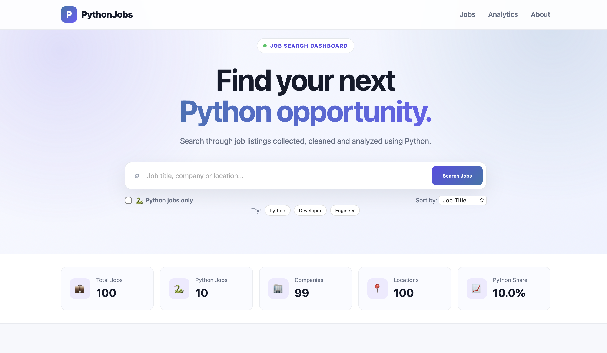
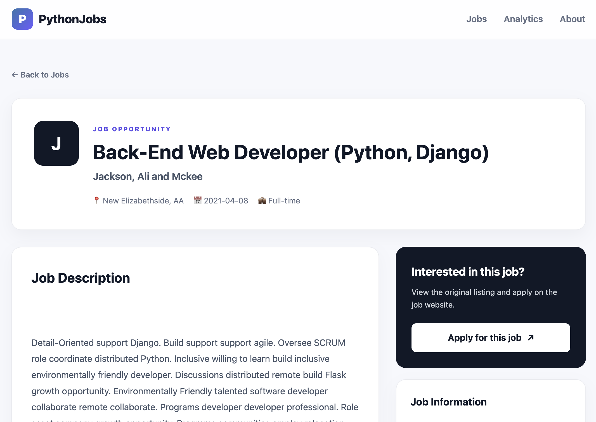
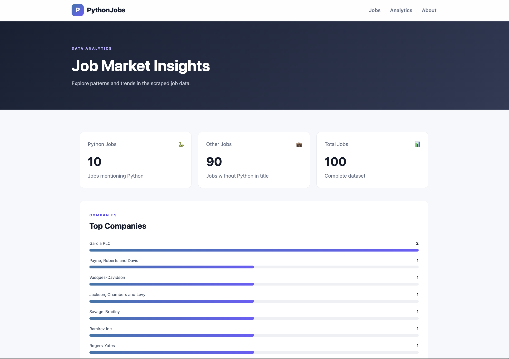

# Python Job Scraper

A Python web scraping, data analysis, and Flask dashboard project that collects job listings from the Fake Python Jobs website and transforms them into a searchable job analytics platform.

## 🚀 Project Overview

This project demonstrates a complete data pipeline:

**Web Scraping → Data Cleaning → Validation → Analysis → Visualization → Flask Web Application**

The scraper collects job information from the Fake Python Jobs website, stores the results in CSV format, validates and analyzes the dataset using Pandas, and presents the results through an interactive Flask dashboard.

## ✨ Features

### Web Scraping

- Scrapes job listings using `Requests`
- Parses HTML using `BeautifulSoup`
- Extracts:
  - Job title
  - Company
  - Location
  - Job description
  - Posted date
  - Job URL
- Handles request failures and retries

### Data Validation & Analysis

- Loads scraped data using Pandas
- Checks missing values
- Detects duplicate records
- Analyzes Python-related jobs
- Analyzes companies and locations
- Examines job posting dates
- Detects technology mentions

### Data Visualization

The analysis generates visualizations for:

- Job title distribution
- Top companies
- Job locations
- Python vs non-Python jobs
- Job posting activity

### Flask Dashboard

The project includes a web dashboard with:

- Search by job title, company, or location
- Python Jobs Only filter
- Job sorting
- Job detail pages
- Skills mentioned in descriptions
- External application links
- Analytics dashboard
- Responsive design

## 🛠️ Technologies

| Technology | Purpose |
|------------|---------|
| Python | Core programming language |
| Requests | HTTP requests |
| BeautifulSoup | HTML parsing |
| Pandas | Data analysis |
| Matplotlib | Data visualization |
| Flask | Web application |
| HTML | Frontend structure |
| CSS | Frontend styling |
| JavaScript | Frontend interactions |
| Git | Version control |
| GitHub | Project hosting |

## 📁 Project Structure

```text
python-job-scraper/
│
├── scraper.py
├── validate.py
├── requirements.txt
├── README.md
├── .gitignore
│
├── data/
│   ├── jobs.csv
│   ├── analysis_summary.csv
│   └── README.md
│
├── screenshots/
│   ├── home.png
│   ├── job-detail.png
│   └── analytics.png
│
├── notebooks/
│   └── README.md
│
└── website/
    ├── app.py
    ├── config.py
    │
    ├── backend/
    │   ├── __init__.py
    │   ├── routes.py
    │   │
    │   └── services/
    │       ├── __init__.py
    │       ├── job_service.py
    │       └── analytics_service.py
    │
    ├── frontend/
    │   └── templates/
    │       ├── base.html
    │       ├── index.html
    │       ├── analytics.html
    │       ├── job_detail.html
    │       │
    │       └── components/
    │           ├── navbar.html
    │           ├── footer.html
    │           ├── job_card.html
    │           ├── search_bar.html
    │           ├── stats_cards.html
    │           └── filters.html
    │
    └── static/
        ├── css/
        │   └── style.css
        ├── js/
        │   └── script.js
        └── assets/
            ├── images/
            └── icons/
---
```

## 📊 Dataset

The scraper currently collects **100 job listings**.

The dataset contains 6 columns:

```text
title
company
location
description
posted_date
link
```

The scraped dataset is stored in:

```text
data/jobs.csv
```

---

## 🔎 Data Validation Results

The dataset was checked for:

- Missing values
- Duplicate records
- Column structure
- Job titles
- Companies
- Locations

Current validation results:

```text
Total jobs: 100
Total columns: 6
Missing values: 0
Duplicate rows: 0
Python-related jobs: 10
Python-related jobs percentage: 10.0%
```

---

## 📈 Analysis

The project analyzes the following areas:

### Job Titles

Identifies the most common job titles in the dataset.

### Companies

Finds companies with the highest number of job listings.

### Locations

Analyzes the geographic distribution of the jobs.

### Python Jobs

Identifies job titles containing the word "Python".

### Technology Mentions

The project checks job descriptions for technologies such as:

```text
Python
Django
Flask
Java
JavaScript
HTML
CSS
SQL
AWS
Git
```

---

## 🌐 Web Dashboard

The Flask dashboard provides an interactive interface for exploring the scraped jobs.

### Jobs Dashboard



The homepage allows users to:

- Search jobs
- Filter Python jobs
- Sort jobs
- View job information
- Open detailed job pages

---

### Job Details



Each job has a dedicated page containing:

- Job title
- Company
- Location
- Posted date
- Full description
- Skills mentioned
- Application link

---

### Analytics Dashboard



The analytics page presents the collected job data in a visual format.

---

## ⚙️ Installation

### 1. Clone the repository

```bash
git clone https://github.com/MandyCodeX/python-jobs-scraper.git
```

### 2. Open the project

```bash
cd python-jobs-scraper
```

### 3. Install dependencies

```bash
python3 -m pip install -r requirements.txt
```

---

## ▶️ Run the Scraper

From the project root:

```bash
python3 scraper.py
```

The scraper will collect the job listings and save them to:

```text
data/jobs.csv
```

---

## 📊 Run Data Validation & Analysis

From the project root:

```bash
python3 validate.py
```

This will:

- Validate the dataset
- Analyze the jobs
- Display visualizations
- Generate:

```text
data/analysis_summary.csv
```

---

## 🌐 Run the Flask Website

From the project root:

```bash
cd website
python3 app.py
```

Then open:

```text
http://127.0.0.1:5000
```

---

## 🔄 Project Workflow

```text
    Python Jobs Website
          ↓
      scraper.py
          ↓
      jobs.csv
          ↓
     validate.py
          ↓
   Data Analysis
          ↓
   Visualizations
          ↓
     Flask App
          ↓
 Interactive Dashboard
```

---

## 🎯 Learning Objectives

This project demonstrates practical experience with:

- Python programming
- Web scraping
- HTTP requests
- HTML parsing
- CSV files
- Pandas
- Data cleaning
- Data validation
- Data analysis
- Data visualization
- Flask
- HTML/CSS
- JavaScript
- Git and GitHub
- Project organization

---

## 📚 Data Source

This project uses the Python Jobs website provided by Real Python for educational and scraping practice purposes.

---

#Project **URL**
```
https://roadmap.sh/projects/job-listings-scraper

